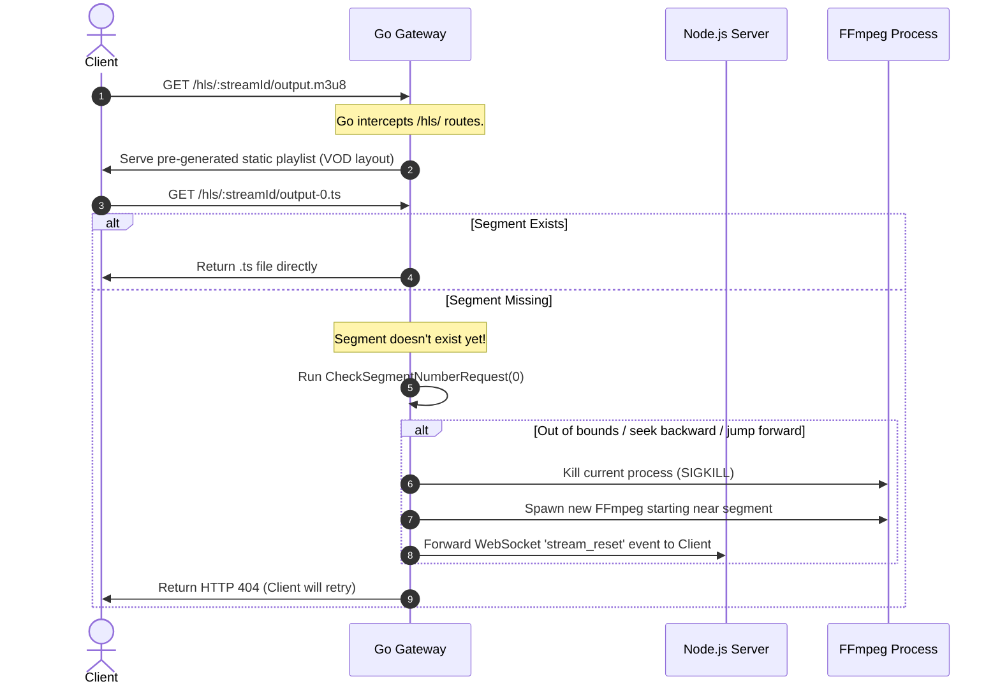

# Audiobookshelf Go Gateway: HLS Transcoding & Streaming Design

This document details the design and implementation plan for porting the HLS (HTTP Live Streaming) transcoding and chunk-serving engine from Node.js to Go. Implementing this within the Go gateway enables high-performance, low-overhead process management and file serving, reducing CPU and memory consumption.

---

## 1. Architectural Analysis of Node.js Streaming Logic

The current Node.js HLS streaming framework is divided across the following files:
- **`server/routers/HlsRouter.js`**: Handles HTTP requests for `.m3u8` playlists and `.ts` audio segments.
- **`server/managers/PlaybackSessionManager.js`**: Orchestrates user playback sessions and associated transcodes.
- **`server/objects/Stream.js`**: Manages the lifecycle of a single transcoding run, including starting, resetting, checking progress, and killing the FFmpeg process.
- **`server/utils/ffmpegHelpers.js`**: Provides utilities for extracting metadata, resizing images, merging files, and writing the input list (`files.txt`) for FFmpeg's `concat` demuxer.
- **`server/utils/generators/hlsPlaylistGenerator.js`**: Generates a static VOD-style playlist `.m3u8` file describing the entire audiobook timeline before any segment is actually transcoded.

### The Request and Transcoding Lifecycle



### Key Mechanisms Analyzed

#### 1. Playlist Pre-generation (`hlsPlaylistGenerator.js`)
Instead of serving a live HLS playlist that grows as transcoding progresses, Audiobookshelf pre-generates a static **VOD** (Video on Demand) playlist covering the entire audiobook length. 
- The file is saved at `output.m3u8`.
- It defines target duration (typically `6` seconds) and lists all segments (`output-0.ts`, `output-1.ts`, etc.) through `#EXTINF`.
- This lets HLS clients immediately see the total duration and allows native seeking.

#### 2. Concat Input (`ffmpegHelpers.js:writeConcatFile`)
Audiobooks are often split into multiple audio tracks. To transcode them seamlessly, a `files.txt` is written using the FFmpeg `concat` format:
```text
file '/path/to/track1.mp3'
duration 1800.0

file '/path/to/track2.mp3'
duration 1800.0
```
- When a stream starts, the starting track is determined by mapping the requested `startTime` to the cumulative durations of all tracks.
- Only the starting track and subsequent tracks are listed in the concat file.
- The accumulated duration of all skipped tracks (`firstTrackStartTime`) is subtracted from `startTime` to obtain the relative offset within the first included track.

#### 3. Seeking & Seek-Back Buffer (`Stream.js:start`)
- To optimize user experience during brief rewind actions, an **adjusted start time** is calculated:
  $$\text{AdjustedStartTime} = \max(StartTime - 30.0, 0.0)$$
- Spawning FFmpeg 30 seconds before the requested position ensures that minor back-steps (e.g., clicking "-10s" twice) do not kill and restart the process.
- The relative offset for FFmpeg input seeking is:
  $$\text{ShiftedStartTime} = \text{AdjustedStartTime} - \text{TrackStartTime}$$
- Passed to FFmpeg via `-ss <ShiftedStartTime>s` as an input option, combined with `-noaccurate_seek` to ensure fast startup.
- The HLS segment writer is configured with `-start_number <SegmentStartNumber>`, where:
  $$\text{SegmentStartNumber} = \lfloor \text{AdjustedStartTime} / \text{SegmentLength} \rfloor$$

#### 4. Fallback Transcoding
- Copying the original audio stream (`-c:a copy`) is the default behavior.
- However, if the track requires conversion (e.g. FLAC, Opus, ALAC, or AC3 codecs, which are forced to AAC via browser/iOS compatibility requirements) or if the `copy` transcode fails with exit code 1, the stream automatically resets and forces AAC encoding (`-c:a aac`).

---

## 2. Go Implementation Design

To replicate and optimize this in Go, we need to design:
1. **Thread-Safe Stream State Structures** to manage running transcoding sessions.
2. **Process Management** to spawn, track, and kill FFmpeg cleanly.
3. **HTTP Route Interceptor** to validate and serve files or trigger resets.
4. **WebSocket Event Bridge** to relay stream lifecycle events back to the client.

### 2.1 State Representation

We represent each active HLS stream using a Go struct containing thread-safe primitives.

```go
package streaming

import (
	"context"
	"os/exec"
	"sync"
	"time"
)

type Stream struct {
	ID                  string
	UserID              string
	LibraryItemID       string
	EpisodeID           string
	StartTime           float64 // Original client requested start time (sec)
	AdjustedStartTime   float64 // Buffer-shifted start time (sec)
	SegmentStartNumber  int     // The index of the first segment written by this transcode run
	SegmentLength       float64 // Typically 6 seconds
	
	StreamPath          string // Base directory containing HLS output files
	ConcatFilesPath     string // Path to the files.txt concat input
	PlaylistPath        string // Path to output.m3u8 (pre-generated)
	FinalPlaylistPath   string // Path to final-output.m3u8 (written by ffmpeg)

	// Process Control
	ffmpegCmd           *exec.Cmd
	ffmpegCancel        context.CancelFunc
	stateMu             sync.RWMutex
	isResetting         bool
	isTranscodeComplete bool
	
	// Segment Tracking
	segmentsMu          sync.RWMutex
	segmentsCreated     map[int]bool
	furthestSegCreated  int
	isClientInitialized bool
}
```

### 2.2 Spawning and Killing FFmpeg

In Go, we use `os/exec` with a `context.Context` to handle graceful and forced cancellation.

> [!WARNING]
> Simple `exec.CommandContext` cancellation will send a `SIGKILL` only to the parent process. If FFmpeg spawns subprocesses or is launched inside a shell wrapper, those processes may escape and become orphans.
> We must set `SysProcAttr.Setpgid = true` on Unix environments and terminate the entire process group.

#### Command Spawning Routine

```go
func (s *Stream) StartTranscode(ctx context.Context, tracks []Track, trackStartTime float64) error {
	s.stateMu.Lock()
	defer s.stateMu.Unlock()

	// Ensure clean slate
	if s.ffmpegCancel != nil {
		s.ffmpegCancel()
	}

	transcodeCtx, cancel := context.WithCancel(context.Background())
	s.ffmpegCancel = cancel

	// Build Concat File (files.txt)
	if err := s.writeConcatFile(tracks); err != nil {
		cancel()
		return err
	}

	shiftedStartTime := s.AdjustedStartTime - trackStartTime
	
	// Prepare FFmpeg Arguments
	args := []string{
		"-seek_timestamp", "1",
		"-f", "concat",
		"-safe", "0",
	}
	
	if s.AdjustedStartTime > 0 {
		args = append(args, 
			"-ss", fmt.Sprintf("%.1fs", shiftedStartTime),
			"-noaccurate_seek",
		)
	}
	
	args = append(args, "-i", s.ConcatFilesPath)

	// Codec configuration (default copy, fallback aac)
	audioCodec := "copy"
	if s.needsAACForce(tracks) {
		audioCodec = "aac"
	}

	args = append(args,
		"-loglevel", "warning",
		"-map", "0:a",
		"-c:a", audioCodec,
		"-f", "hls",
		"-copyts",
		"-avoid_negative_ts", "make_non_negative",
		"-max_delay", "5000000",
		"-max_muxing_queue_size", "2048",
		"-hls_time", fmt.Sprintf("%.0f", s.SegmentLength),
		"-hls_segment_type", "mpegts",
		"-start_number", fmt.Sprintf("%d", s.SegmentStartNumber),
		"-hls_playlist_type", "vod",
		"-hls_list_size", "0",
		"-hls_allow_cache", "0",
		"-hls_segment_filename", filepath.Join(s.StreamPath, "output-%d.ts"),
		s.FinalPlaylistPath,
	)

	cmd := exec.CommandContext(transcodeCtx, "ffmpeg", args...)
	
	// Unix process group isolation to prevent orphan processes
	cmd.SysProcAttr = &syscall.SysProcAttr{Setpgid: true}
	s.ffmpegCmd = cmd

	// Start running asynchronously
	if err := cmd.Start(); err != nil {
		cancel()
		return err
	}

	// Wait goroutine
	go func() {
		err := cmd.Wait()
		s.stateMu.Lock()
		defer s.stateMu.Unlock()
		
		s.isTranscodeComplete = true
		s.ffmpegCmd = nil
		if err != nil {
			// Handle fallback to AAC if exit status is 1 and copy failed
			if exitErr, ok := err.(*exec.ExitError); ok && exitErr.ExitCode() == 1 {
				go s.ResetToAAC()
			}
		}
	}()

	return nil
}
```

#### Process Termination

To reliably terminate the FFmpeg process group:

```go
func (s *Stream) KillFFmpeg() {
	s.stateMu.Lock()
	defer s.stateMu.Unlock()

	if s.ffmpegCancel != nil {
		s.ffmpegCancel() // Cancels Context
	}
	
	if s.ffmpegCmd != nil && s.ffmpegCmd.Process != nil {
		// Send SIGKILL to the entire process group
		pgid, err := syscall.Getpgid(s.ffmpegCmd.Process.Pid)
		if err == nil {
			_ = syscall.Kill(-pgid, syscall.SIGKILL)
		} else {
			_ = s.ffmpegCmd.Process.Kill()
		}
		s.ffmpegCmd = nil
	}
}
```

### 2.3 Seek Detection & Check Segment Request

When the HTTP handler intercepts a `.ts` segment request and the file is missing, it calls `CheckSegmentNumberRequest`.

```go
func (s *Stream) CheckSegmentNumberRequest(segNum int) (float64, bool) {
	s.stateMu.RLock()
	isComplete := s.isTranscodeComplete
	s.stateMu.RUnlock()

	if isComplete {
		return 0, false
	}

	segStartTime := float64(segNum) * s.SegmentLength

	// Case 1: Seek backward before the start number of current transcode run
	if segNum < s.SegmentStartNumber {
		return segStartTime, true
	}

	// Case 2: Seek forward beyond the currently transcoded window (buffer limit = 10 segments)
	s.segmentsMu.RLock()
	furthest := s.furthestSegCreated
	s.segmentsMu.RUnlock()

	if furthest > 0 {
		diff := segNum - furthest
		if diff > 10 {
			return segStartTime, true
		}
	}

	return 0, false
}
```

If it returns `(resetTime, true)`, the HTTP router triggers `Reset(resetTime)` which:
1. Kills the running FFmpeg process.
2. Adjusts `s.StartTime = resetTime`.
3. Recalculates `s.AdjustedStartTime` and `s.SegmentStartNumber`.
4. Spawns a new FFmpeg command.
5. Emits the `stream_reset` event to the client so that the player updates its request alignment.

---

## 3. HTTP Request Interception in Go Gateway

We integrate the HLS streaming router into `main.go`. Since Go acts as a gateway proxy, we intercept `/audiobookshelf/hls/` calls.

```go
// Add to mux in main.go
mux.HandleFunc(cfg.RouterBasePath+"/hls/", serveHLS(cfg.MetadataPath, streamManager))
```

### Handler Design

```go
func serveHLS(metadataPath string, sm *StreamManager) http.HandlerFunc {
	return func(w http.ResponseWriter, r *http.Request) {
		// URL Format: /audiobookshelf/hls/:streamId/:file
		pathParts := strings.Split(strings.TrimPrefix(r.URL.Path, "/audiobookshelf/hls/"), "/")
		if len(pathParts) < 2 {
			http.Error(w, "Invalid path format", http.StatusBadRequest)
			return
		}
		streamID := pathParts[0]
		fileName := pathParts[1]

		// Validate File Type
		ext := filepath.Ext(fileName)
		if ext != ".ts" && ext != ".m3u8" {
			http.Error(w, "Unsupported file format", http.StatusBadRequest)
			return
		}

		stream := sm.GetStream(streamID)
		if stream == nil {
			http.Error(w, "Stream not found", http.StatusNotFound)
			return
		}

		streamDir := filepath.Join(metadataPath, "streams", streamID)
		fullFilePath := filepath.Join(streamDir, fileName)

		// Prevent Directory Traversal
		if !validateStreamFilePath(streamDir, fullFilePath) {
			http.Error(w, "Invalid file parameters", http.StatusBadRequest)
			return
		}

		// Serve file if it exists
		if _, err := os.Stat(fullFilePath); err == nil {
			if ext == ".ts" {
				// Mark segment as created for tracking
				segNum := parseSegmentNumber(fileName)
				stream.MarkSegmentCreated(segNum)
			}
			http.ServeFile(w, r, fullFilePath)
			return
		}

		// Handle missing TS file (seek trigger or waiting)
		if ext == ".ts" {
			segNum := parseSegmentNumber(fileName)
			if resetTime, shouldReset := stream.CheckSegmentNumberRequest(segNum); shouldReset {
				log.Printf("[HLS Gateway] Resetting stream %s at segment %d (time %.2fs)", streamID, segNum, resetTime)
				
				// Reset transcode starting near the requested timestamp
				go stream.Reset(resetTime - (stream.SegmentLength * 5))
				
				// Emit reset websocket event to client via Node.js websocket bridge
				emitWebsocketEvent(stream.UserID, "stream_reset", map[string]interface{}{
					"startTime": resetTime,
					"streamId":  streamID,
				})
			}
		}

		// Return 404 for missing segment. HLS client will retry.
		http.Error(w, "Segment not ready", http.StatusNotFound)
	}
}

#### Path Validation & Segment Parsing Helpers

```go
func validateStreamFilePath(streamDir, filepathVal string) bool {
	rel, err := filepath.Rel(streamDir, filepathVal)
	if err != nil {
		return false
	}
	return !strings.HasPrefix(rel, "..") && rel != ".." && !filepath.IsAbs(rel)
}

func parseSegmentNumber(fileName string) int {
	base := strings.TrimSuffix(fileName, filepath.Ext(fileName))
	parts := strings.Split(base, "-")
	if len(parts) < 2 {
		return -1
	}
	var num int
	_, err := fmt.Sscanf(parts[1], "%d", &num)
	if err != nil {
		return -1
	}
	return num
}
```

```

---

## 4. WebSocket Event Bridging (Go -> Node.js)

### The Challenge
The Go gateway acts as an HTTP proxy in front of the Node.js application. WebSocket connections (`/socket.io/`) are terminated by the Node.js server. 
Consequently, Go cannot write directly to the client's WebSocket connection to trigger HLS events like `stream_reset`, `stream_progress`, or `stream_ready`.

### Solution Options

| Approach | Mechanics | Pros | Cons |
| :--- | :--- | :--- | :--- |
| **Option 1: Internal HTTP Bridge** | Go issues a loopback HTTP `POST /api/internal/emit-websocket` request to Node.js, which forwards the payload over Socket.io. | Simple, uses existing Node.js socket infrastructure. | Small HTTP call overhead. |
| **Option 2: Redis / IPC PubSub** | Go and Node.js share a Redis instance or Unix domain socket for IPC messaging. | Low latency, decoupled. | Adds external dependencies (Redis) or local socket setup. |

#### Recommended Implementation (Option 1)
Create a lightweight loopback API route in Node.js (restricted to `localhost` calls):
```javascript
// Node.js Express internal route
router.post('/api/internal/emit-websocket', (req, res) => {
  const { userId, event, payload } = req.body;
  SocketAuthority.clientEmitter(userId, event, payload);
  res.sendStatus(200);
});
```

Go emits events via:
```go
func emitWebsocketEvent(userID string, event string, payload interface{}) {
	bridgeURL := "http://localhost:3334/api/internal/emit-websocket"
	body, _ := json.Marshal(map[string]interface{}{
		"userId":  userID,
		"event":   event,
		"payload": payload,
	})
	
	resp, err := http.Post(bridgeURL, "application/json", bytes.NewBuffer(body))
	if err == nil {
		resp.Body.Close()
	}
}
```

---

## 5. File Scanning & Cleanups in Go

### Segment Tracking Goroutine (`checkFiles` equivalent)
A background tick loop is run for each streaming session to update progress and notify readiness:

```go
func (s *Stream) RunProgressTracker(ctx context.Context) {
	ticker := time.NewTicker(2 * time.Second)
	defer ticker.Stop()

	for {
		select {
		case <-ctx.Done():
			return
		case <-ticker.C:
			s.stateMu.RLock()
			complete := s.isTranscodeComplete
			s.stateMu.RUnlock()

			if complete {
				emitWebsocketEvent(s.UserID, "stream_ready", s.ID)
				return
			}

			s.scanCreatedSegments()
			
			// Build status and publish stream_progress event
			percent := (float64(len(s.segmentsCreated)) / float64(s.TotalSegments())) * 100
			emitWebsocketEvent(s.UserID, "stream_progress", map[string]interface{}{
				"stream":      s.ID,
				"percent":     fmt.Sprintf("%.2f%%", percent),
				"numSegments": s.TotalSegments(),
			})

			// Notify stream_open on startup once a small buffer (6 segments) is cached
			if len(s.segmentsCreated) > 6 && !s.isClientInitialized {
				s.isClientInitialized = true
				emitWebsocketEvent(s.UserID, "stream_open", s.ToJSON())
			}
		}
	}
}
```

### Stale Stream / Orphan Cleanups
- A global routine in Go runs hourly, checking `stream.lastUpdated`. If a stream has not received segment requests or sync updates for over 36 hours, `stream.Close()` is called to terminate FFmpeg and purge segment folders from `/metadata/streams`.
