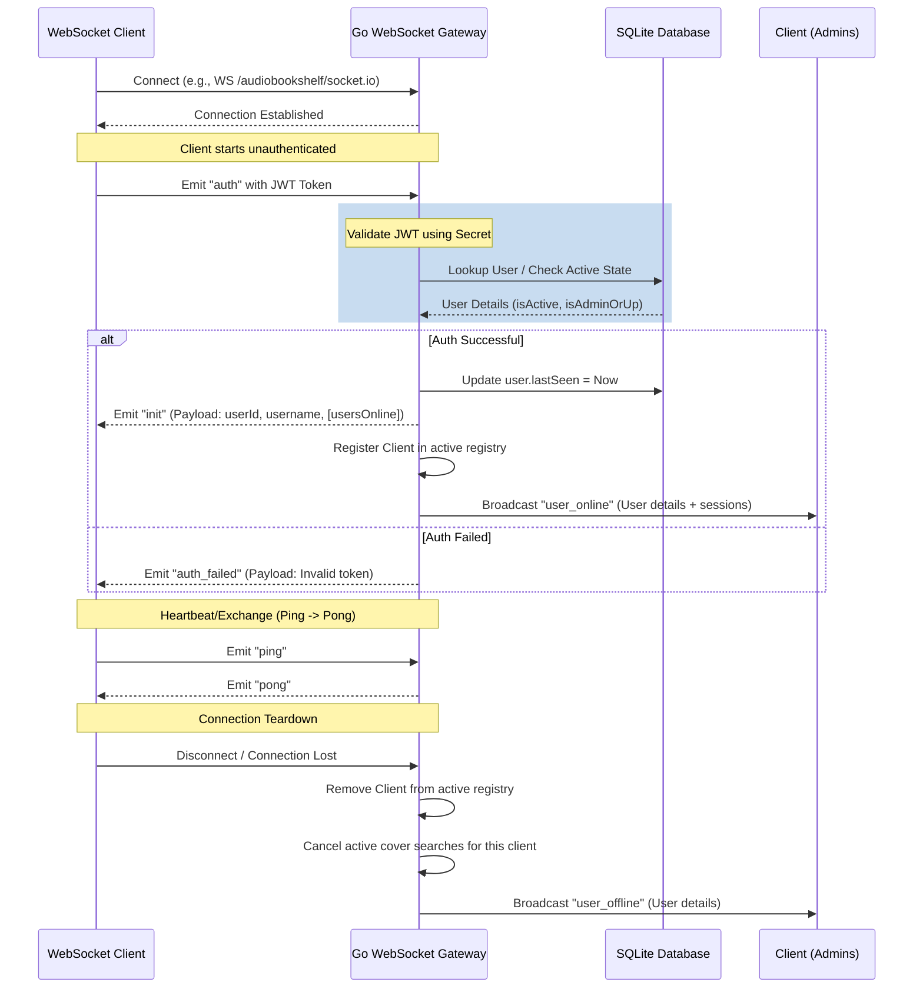

# Audiobookshelf Go Gateway: Real-Time Synchronization Layer Design

This document details the design and implementation strategy for the WebSocket real-time synchronization layer in Go, matching the Node.js implementation found in `server/SocketAuthority.js` of the legacy server.

---

## 1. Executive Summary & Design Overview

Audiobookshelf coordinates real-time synchronization between clients (Vue/Nuxt web application, iOS/Android mobile apps) and the server using WebSockets. In the legacy codebase, this is managed by `SocketAuthority.js`. 

Rather than utilizing traditional WebSocket pub/sub mechanisms (such as Socket.io rooms), the current design relies on an **application-filtered broadcaster**. It tracks socket sessions in a flat, in-memory registry (`clients` map) and dynamically evaluates access permissions (e.g., library visibility, admin status) on a per-socket basis at the moment of emission.

### Core Architecture Characteristics
* **Connection Multiplexing:** Two endpoints are supported: `/socket.io` and optional sub-path connections like `<RouterBasePath>/socket.io` (e.g. `/audiobookshelf/socket.io`).
* **JWT-Based Authentication:** Connections are authenticated asynchronously via a custom socket-level handshake event (`auth`), rather than HTTP headers, allowing clients to re-authenticate if their token changes.
* **Dynamic Client Filtering:** Events are distributed using specific emitter helper functions that iterate over connected clients and check constraints such as admin status or library item accessibility.
* **State Updates:** Critical states like user playback progress, transcoding progress, library modifications, and server tasks are streamed continuously to keep all active client screens in sync.

---

## 2. Client & Server Connection Lifecycle



### 1. Connection Initialization
On connection, a socket client is registered in the flat `clients` map with its `id` and `connected_at` timestamp. At this stage, the client is **unauthorized** and is not forwarded any broadcast messages.

### 2. Authentication Handshake
Clients must emit an `auth` event with their JWT access token. 
* The server parses and validates the JWT (matching the logic in `auth.go`).
* Upon success, the socket session is bound to the corresponding `User` object.
* The server updates the user's `lastSeen` timestamp in the database.
* The server sends an `init` event to the connecting socket containing the user's details and, if the user is an admin, the list of currently online users.
* The server broadcasts `user_online` to all admin clients.

### 3. Disconnection
When a client disconnects, the server:
* Removes the client from the active registry.
* Removes any registered log listeners for that socket.
* Cancels active cover searches initiated by this socket session.
* If the client was authenticated, broadcasts `user_offline` to all admin clients.

---

## 3. Room & Client Selection Strategy

In `SocketAuthority.js`, traditional Socket.io rooms are **not used**. Instead, target client sets are determined dynamically when events are emitted:

| Emitter Helper | Node.js Implementation | Recommended Go Strategy |
| :--- | :--- | :--- |
| `emitter(evt, data, filter)` | Iterates over all clients and applies a custom filter function (e.g., checking if user exists). | Iterate over clients map under `sync.RWMutex`, matching filter criteria. |
| `clientEmitter(userId, evt, data)` | Targets all socket connections belonging to a single user (for multi-device sync). | Filter connection registry by `userID` and send to matching connections. |
| `adminEmitter(evt, data)` | Filters clients where `user.isAdminOrUp` is true. | Iterate and filter clients where `user.Type == "root"` or `user.Type == "admin"`. |
| `libraryItemEmitter(evt, item)` | Evaluates `checkCanAccessLibraryItem(item)` for each client. | Perform database or cached lookup on user's library permissions, then emit. |
| `libraryItemsEmitter(evt, items)` | Filters the list of items based on each client's access list and emits the custom filtered array to each. | For each client, compute the slice of accessible items and emit. |

> [!NOTE]
> Because Go executes iterations extremely quickly, looping through a registry of a few hundred clients is negligible in CPU cost. For larger installations (>1000 concurrent sockets), implementing a subscription-based room model (e.g., mapping users to `library:<id>` or `user:<id>` channels) would optimize event distribution.

---

## 4. Socket Event Catalog

### Client-to-Server (C -> S) Events
These are events emitted by clients that the Go Gateway must listen for and process:

| Event Name | Role Required | Payload | Description |
| :--- | :--- | :--- | :--- |
| `auth` | Any | `string` (JWT Token) | Authenticates the socket connection and completes handshake. |
| `ping` | Any | None | Heartbeat check. Server immediately responds with `pong`. |
| `cancel_scan` | Admin | `string` (Library ID) | Cancels an active scan on the specified library. |
| `search_covers` | User | `Object` (Cover Search Request) | Initiates an asynchronous, streamed cover image search. |
| `cancel_cover_search`| User | `string` (Request ID) | Cancels an ongoing cover search request. |
| `set_log_listener` | Admin | `int` (Log Level) | Registers the socket to receive live application logs. |
| `remove_log_listener`| Admin | None | Unregisters the socket from receiving live logs. |
| `message_all_users` | Admin | `{ message: string }` | Sends an administrative message (toast) to all connected users. |

### Server-to-Client (S -> C) Events
These are events emitted by the server to one or more clients:

| Event Name | Recipient | Description |
| :--- | :--- | :--- |
| `auth_failed` | Single Client | Authentication failed (e.g., expired token). |
| `init` | Single Client | Confirms successful authentication; details the logged-in user and online users (for admins). |
| `pong` | Single Client | Response to `ping` event. |
| `user_online` | Admins | Emitted when a user completes authentication. |
| `user_offline` | Admins | Emitted when a user disconnects. |
| `user_updated` | Owner / Admins | Emitted when user settings, permissions, or profile details are modified. |
| `user_stream_update` | Admins | Broadcasts the list of online users with their active playback session stats. |
| `user_session_closed` | Owner | Emitted when a playback session is closed. |
| `user_item_progress_updated` | Owner | Syncs current playback progress across all of a user's open client sessions. |
| `admin_message` | All | Administrative message (displayed as a toast notification). |
| `library_added` / `_updated` / `_removed` | Authorized | Broadcasts library creation, updates, or deletion. |
| `item_added` / `_updated` / `_removed` | Authorized | Dispatches library item metadata changes (filtered by user access permissions). |
| `items_added` / `_updated` | Authorized | Batch version of library item additions or updates. |
| `author_added` / `_updated` / `_removed` | All | Broadcasts author metadata updates. |
| `collection_added` / `_updated` / `_removed` | Authorized | Broadcasts book collections modifications. |
| `series_added` / `_updated` / `_removed` | Authorized | Broadcasts series modifications. |
| `playlist_added` / `_updated` / `_removed` | Owner | Synced playlists (specific to the owner). |
| `task_started` / `_finished` / `_progress` | Admins / Owner | Live progress updates for background tasks (e.g., library scans, encodes). |
| `track_started` / `_progress` / `_finished` | Admins | Sub-task tracking for audio file merges and metadata embedding. |
| `metadata_embed_queue_update` | Admins | Updates on queued metadata embed items. |
| `cover_search_result` | Requester | Streams single cover search results. |
| `cover_search_complete` / `_error` / `_cancelled` | Requester | Final state updates for the requested cover search. |
| `rss_feed_open` / `rss_feed_closed` | All | Emitted when a podcast RSS feed is opened or closed. |
| `backup_applied` | All | Sent after database restore, forcing client reload. |
| `batch_quickmatch_complete` | Requester | Reports completion of batch quickmatch operations. |
| `stream_open` | Requester | Starts a transcoding playback stream (sends playlist URL, start segment). |
| `stream_progress` | Requester | Streams transcoding segment completions and buffers. |
| `stream_ready` | Requester | Notifies the client that transcoding buffer is sufficient to start playback. |
| `stream_error` / `_closed` / `_reset` | Requester | Stream failure, closure, or seek reset. |

---

## 5. Detailed Payload Structures & Go Struct Mapping

Below are the JSON structures and corresponding Go models for the most performance-sensitive, real-time events.

### 1. The `init` Event
Sent to a client immediately upon successful authentication. If the user is an admin, the `usersOnline` field is populated with currently active users and their active playback sessions.

#### JSON Payload
```json
{
  "userId": "d7b9736c-9411-4091-bb27-7cf4c13a2160",
  "username": "admin",
  "usersOnline": [
    {
      "id": "d7b9736c-9411-4091-bb27-7cf4c13a2160",
      "username": "admin",
      "type": "root",
      "isActive": true,
      "connections": 1,
      "lastSeen": 1686254140000,
      "playbackSessions": []
    }
  ]
}
```

#### Go Structs
```go
type OnlineUser struct {
	ID               string           `json:"id"`
	Username         string           `json:"username"`
	Type             string           `json:"type"`
	IsActive         bool             `json:"isActive"`
	Connections      int              `json:"connections"`
	LastSeen         int64            `json:"lastSeen"`
	PlaybackSessions []interface{}    `json:"playbackSessions"` // Map to PlaybackSession struct if needed
}

type InitPayload struct {
	UserID      string       `json:"userId"`
	Username    string       `json:"username"`
	UsersOnline []OnlineUser `json:"usersOnline,omitempty"` // Omitted for non-admins
}
```

### 2. The `user_item_progress_updated` Event
Dispatched to all active connections of a user when playback progresses or finishes on any device.

#### JSON Payload
```json
{
  "id": "progress_abc123",
  "sessionId": "play_session_xyz789",
  "deviceDescription": "Chrome / Linux",
  "data": {
    "id": "progress_abc123",
    "userId": "d7b9736c-9411-4091-bb27-7cf4c13a2160",
    "libraryItemId": "item_001",
    "episodeId": null,
    "mediaItemId": "media_book_001",
    "mediaItemType": "book",
    "duration": 3600.5,
    "progress": 0.15,
    "currentTime": 540.075,
    "isFinished": false,
    "hideFromContinueListening": false,
    "ebookLocation": null,
    "ebookProgress": 0.0,
    "lastUpdate": 1686254140500,
    "startedAt": 1686250000000,
    "finishedAt": null
  }
}
```

#### Go Structs
```go
type MediaProgressData struct {
	ID                        string   `json:"id"`
	UserID                    string   `json:"userId"`
	LibraryItemID             string   `json:"libraryItemId"`
	EpisodeID                 *string  `json:"episodeId"`
	MediaItemID               string   `json:"mediaItemId"`
	MediaItemType             string   `json:"mediaItemType"` // "book" or "podcastEpisode"
	Duration                  float64  `json:"duration"`
	Progress                  float64  `json:"progress"`
	CurrentTime               float64  `json:"currentTime"`
	IsFinished                bool     `json:"isFinished"`
	HideFromContinueListening bool     `json:"hideFromContinueListening"`
	EbookLocation             *string  `json:"ebookLocation"`
	EbookProgress             float64  `json:"ebookProgress"`
	LastUpdate                int64    `json:"lastUpdate"`
	StartedAt                 int64    `json:"startedAt"`
	FinishedAt                *int64   `json:"finishedAt"`
}

type UserItemProgressUpdatedPayload struct {
	ID                string            `json:"id"`
	SessionID         string            `json:"sessionId"`
	DeviceDescription string            `json:"deviceDescription"`
	Data              MediaProgressData `json:"data"`
}
```

### 3. The `stream_open` Event
Sent to the playback client when a transcoded HLS stream initializes, detailing segment options and paths.

#### JSON Payload
```json
{
  "id": "session_stream_99",
  "userId": "d7b9736c-9411-4091-bb27-7cf4c13a2160",
  "libraryItem": {}, 
  "episode": null,
  "segmentLength": 6,
  "playlistPath": "/metadata/streams/session_stream_99/output.m3u8",
  "clientPlaylistUri": "/hls/session_stream_99/output.m3u8",
  "startTime": 540.0,
  "segmentStartNumber": 90,
  "isTranscodeComplete": false
}
```

#### Go Structs
```go
type StreamOpenPayload struct {
	ID                  string      `json:"id"`
	UserID              string      `json:"userId"`
	LibraryItem         interface{} `json:"libraryItem"` // Expanded library item json representation
	Episode             interface{} `json:"episode"`     // Nullable podcast episode
	SegmentLength       int         `json:"segmentLength"`
	PlaylistPath        string      `json:"playlistPath"`
	ClientPlaylistURI   string      `json:"clientPlaylistUri"`
	StartTime           float64     `json:"startTime"`
	SegmentStartNumber  int         `json:"segmentStartNumber"`
	IsTranscodeComplete bool        `json:"isTranscodeComplete"`
}
```

### 4. The `stream_progress` Event
Fired periodically during active transcoding, indicating segments generated.

#### JSON Payload
```json
{
  "stream": "session_stream_99",
  "percent": "35.50%",
  "chunks": ["90-112", 114, "116-120"],
  "numSegments": 600
}
```

#### Go Structs
```go
type StreamProgressPayload struct {
	Stream      string        `json:"stream"`
	Percent     string        `json:"percent"`
	Chunks      []interface{} `json:"chunks"` // Mix of numbers (114) and strings ("90-112")
	NumSegments int           `json:"numSegments"`
}
```

---

## 6. Recommended Go Implementation Stack & Architecture

### Recommended Library: `zishang520/socket.io`
Since the Audiobookshelf client is a Nuxt application heavily relying on `nuxt-socket-io`, transitioning to pure, raw WebSockets would require changing the frontend transport layer.
Using `github.com/zishang520/socket.io` in Go is highly recommended. It implements the Socket.io v4 protocol natively, including Engine.io transport, socket heartbeats, namespaces, connection buffers, and authentication handshakes.

### Architecture Layout: Gateway Hub
A typical hub-and-spoke concurrent architecture using channels is recommended to guarantee race-free mutations of client data:

```go
package gateway

import (
	"sync"
	"time"
)

// SocketClient wraps a socket connection with authentication information
type SocketClient struct {
	ID          string
	Socket      interface{} // e.g., socket.Socket from zishang520
	ConnectedAt time.Time
	User        *UserSession // Loaded from auth.go / db.go
}

type SocketAuthority struct {
	mu      sync.RWMutex
	clients map[string]*SocketClient
}

func NewSocketAuthority() *SocketAuthority {
	return &SocketAuthority{
		clients: make(map[string]*SocketClient),
	}
}

// AddClient registers a new connection
func (sa *SocketAuthority) AddClient(id string, socket interface{}) {
	sa.mu.Lock()
	defer sa.mu.Unlock()
	sa.clients[id] = &SocketClient{
		ID:          id,
		Socket:      socket,
		ConnectedAt: time.Now(),
	}
}

// Authenticate associates a user session with an existing client connection
func (sa *SocketAuthority) Authenticate(id string, user *UserSession) {
	sa.mu.Lock()
	defer sa.mu.Unlock()
	if client, ok := sa.clients[id]; ok {
		client.User = user
	}
}

// RemoveClient deletes a connection
func (sa *SocketAuthority) RemoveClient(id string) {
	sa.mu.Lock()
	defer sa.mu.Unlock()
	delete(sa.clients, id)
}

// ClientEmitter emits an event to all socket connections of a specific user
func (sa *SocketAuthority) ClientEmitter(userID string, event string, data interface{}) {
	sa.mu.RLock()
	defer sa.mu.RUnlock()
	for _, client := range sa.clients {
		if client.User != nil && client.User.ID == userID {
			sa.emit(client.Socket, event, data)
		}
	}
}

// AdminEmitter emits an event to all authenticated admin sockets
func (sa *SocketAuthority) AdminEmitter(event string, data interface{}) {
	sa.mu.RLock()
	defer sa.mu.RUnlock()
	for _, client := range sa.clients {
		if client.User != nil && (client.User.Type == "root" || client.User.Type == "admin") {
			sa.emit(client.Socket, event, data)
		}
	}
}

func (sa *SocketAuthority) emit(socket interface{}, event string, data interface{}) {
	// Call library-specific socket.Emit(event, data)
}
```

### Implementing Cover Search & Streams (Asynchronous Task Dispatching)
For tasks like `search_covers` and transcoding loops that run asynchronously:
1. When `search_covers` is received over the socket, spin up a Go routine: `go startCoverSearch(clientSocket, requestPayload)`.
2. Ensure you have a check matching `cancel_cover_search` that can signal the goroutine to terminate using a Go context: `context.WithCancel(parentCtx)`. Store the cancel function in an active search map (`map[string]context.CancelFunc`) associated with the client session.
3. Upon socket `disconnect`, check and call cancel functions for all active searches associated with that `socket.id`.

### Integration with `main.go`
Currently, the `/socket.io/` requests are proxied directly to Node.js in `main.go`:
```diff
- prefixes := []string{"/api/", "/auth/", "/hls/", "/public/", "/feed/", "/socket.io/", "/status", "/login", "/logout", "/init"}
+ prefixes := []string{"/api/", "/auth/", "/hls/", "/public/", "/feed/", "/status", "/login", "/logout", "/init"}
```
By removing `/socket.io/` from the proxy list, the HTTP server in `main.go` can route these requests to the local Go Socket.io server handler.
